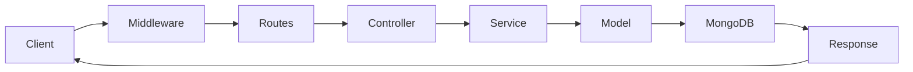

# 🚀 ITEM BUILDER API

Production-ready **Backend API for Item Builder Platform** built with **Node.js, Express, TypeScript, and MongoDB**.

This service powers the **Item Builder system**, enabling management of:

* Categories
* Subcategories
* Products
* Builder items
* Admin & staff operations
* Media uploads

The API follows a **scalable modular architecture** using **MVC + Service Layer**.

---

# 🧠 Tech Stack

| Technology  | Purpose              |
| ----------- | -------------------- |
| Node.js     | Runtime              |
| Express.js  | Web framework        |
| TypeScript  | Type safety          |
| MongoDB     | Database             |
| Mongoose    | ODM                  |
| Zod         | Request validation   |
| JWT         | Authentication       |
| Swagger     | API documentation    |
| Cloudinary  | Image storage        |
| Morgan      | Logging              |
| Helmet      | Security headers     |
| CORS        | Cross-origin control |
| Compression | Response compression |

---

# 🏗 Architecture

The backend follows a **modular MVC architecture**.

```
Request
   ↓
Middleware
   ↓
Routes
   ↓
Controller
   ↓
Service
   ↓
Model
   ↓
MongoDB
   ↓
JSON Response
```

### Request Flow



---

# 📂 Project Structure

```
src
│
├── server.ts
├── app.ts
│
├── config
│   ├── env.ts
│   └── loadEnv.ts
│
├── db
│   └── connect.ts
│
├── middlewares
│   ├── auth.ts
│   ├── requireRole.ts
│   └── errorHandler.ts
│
├── utils
│   ├── AppError.ts
│   ├── response.ts
│   ├── auth.ts
│   ├── slugify.ts
│   ├── pagination.ts
│   └── cloudinary.ts
│
└── modules
    ├── index.ts
    │
    ├── health
    ├── auth
    ├── admin
    ├── category
    ├── subcategory
    ├── product
    └── upload
```

Each module follows the same pattern:

```
module/
 ├── routes.ts
 ├── controller.ts
 ├── service.ts
 ├── model.ts
 └── schemas.ts
```

---

# ⚙️ Installation

Clone the repository:

```bash
git clone https://github.com/your-org/item-builder-api.git
cd item-builder-api
```

Install dependencies:

```bash
npm install
```

Copy environment variables:

```bash
cp .env.example .env
```

Start development server:

```bash
npm run dev
```

---

# 🔐 Environment Variables

See **`.env.example`** for full list (Mongo, JWT, Cloudinary, **Shippo**, **Stripe**, **TaxJar**, **QuickBooks** placeholders).

---

# 🛒 Ecommerce checkout (US + military mail)

Flow:

1. **Cart** — `PUT /api/v1/cart` (items: `productId`, `quantity`, optional `variantIndex`, `addOnIndexes`).
2. **Address** — `POST /api/v1/addresses` (US street or **APO/FPO/DPO**: city = `APO`/`FPO`/`DPO`, state = `AA`/`AE`/`AP`, ZIP `09xxx`).
3. **Rates** — `GET /api/v1/shipping/rates?addressId=...` (**Shippo**, ship-from CA in `.env`).
4. **Preview** — `POST /api/v1/orders/preview` with `addressId` + `shippoRateObjectId` (tax: **TaxJar** or **CA_FALLBACK_TAX_RATE** for CA destinations).
5. **Pay** — `POST /api/v1/orders` with `paymentMethod`: `"stripe"` (default) or `"cod"`. Stripe returns `clientSecret`; COD skips Stripe and sets order to **processing** / **unpaid** until admin marks **paid** after cash collection.
6. **Webhook** — `POST /api/v1/webhooks/stripe` (raw body) with `STRIPE_WEBHOOK_SECRET`.

**Payments:** Stripe `automatic_payment_methods` supports **card**, **US bank (ACH)**, **Link**; **Apple Pay** via Safari / wallet. **PayPal** and **Venmo** are not fully covered by Stripe alone — use **PayPal Commerce** or **Braintree** as an extra integration if required.

**QuickBooks:** `GET /api/v1/integrations/quickbooks/status` — OAuth + SalesReceipt sync is a **Phase 2** placeholder; payments stay on Stripe until wired.

**Admin orders:** `GET /api/v1/admin/orders` (optional `?userId=`), `POST /api/v1/admin/orders` (body: `userId`, `items[]`, `addressId`, and either `shippoRateObjectId` **or** `shippingCents` for manual shipping), `GET/PATCH /api/v1/admin/orders/:id`, `GET /api/v1/admin/orders/stats/summary`. PATCH body may include `paymentStatus` (e.g. mark COD **paid**).

**Admin addresses:** `GET/POST /api/v1/admin/users/:userId/addresses`, `PATCH/DELETE .../addresses/:addressId`.

Set **`weightOz` / dimensions** on products (or defaults in `.env`) for accurate Shippo quotes.

---

# 📡 API Documentation

Interactive API documentation is available via **Swagger**.

| Resource     | URL                             |
| ------------ | ------------------------------- |
| Swagger UI   | http://localhost:8080/docs      |
| OpenAPI JSON | http://localhost:8080/docs.json |

---

# 📦 Core Modules

## Health

Basic server status.

```
GET /api/v1/health
```

---

## Authentication

User authentication and account management.

```
POST /api/v1/auth/register
POST /api/v1/auth/login
POST /api/v1/auth/verify-email
POST /api/v1/auth/forgot-password
POST /api/v1/auth/reset-password
```

---

## Admin

Admin and staff management.

```
GET /api/v1/admin/staff
POST /api/v1/admin/staff
PATCH /api/v1/admin/staff/:id
DELETE /api/v1/admin/staff/:id
```

---

## Categories

Manage product categories.

```
GET /api/v1/categories
POST /api/v1/categories
PATCH /api/v1/categories/:id
DELETE /api/v1/categories/:id
```

---

## Subcategories

Manage category subdivisions.

```
GET /api/v1/subcategories
POST /api/v1/subcategories
PATCH /api/v1/subcategories/:id
DELETE /api/v1/subcategories/:id
```

---

## Products

Manage products used inside the builder.

```
GET /api/v1/products
GET /api/v1/products/:id

POST /api/v1/products
PATCH /api/v1/products/:id
DELETE /api/v1/products/:id
```

Products support:

* thumbnail
* image gallery
* document URL
* variants
* options
* add-ons

---

## Upload

Media upload endpoints.

```
POST /api/v1/upload/image
POST /api/v1/upload/images
POST /api/v1/upload/document
```

Uploads are stored using **Cloudinary**.

---

# 🔐 Authentication & Authorization

Protected routes require a **JWT token**.

Example header:

```
Authorization: Bearer <token>
```

Role-based access control:

| Role  | Permissions                |
| ----- | -------------------------- |
| Admin | Full access                |
| Staff | Manage categories/products |
| User  | Read-only                  |

---

# 📊 Middleware Stack

```
Helmet
CORS
express.json
Compression
Morgan
JWT Authentication
Role Authorization
Error Handler
```

---

# 🧪 Scripts

| Command       | Description              |
| ------------- | ------------------------ |
| npm run dev   | Start development server |
| npm run build | Build TypeScript         |
| npm run start | Start production server  |
| npm run lint  | Run ESLint               |

---

# 🧱 Production Features

✔ Modular architecture
✔ Type-safe validation (Zod)
✔ Role-based access control
✔ Centralized error handling
✔ API documentation with Swagger
✔ Secure headers via Helmet
✔ Structured logging with Morgan
✔ Cloudinary image storage
✔ Pagination & filtering utilities


